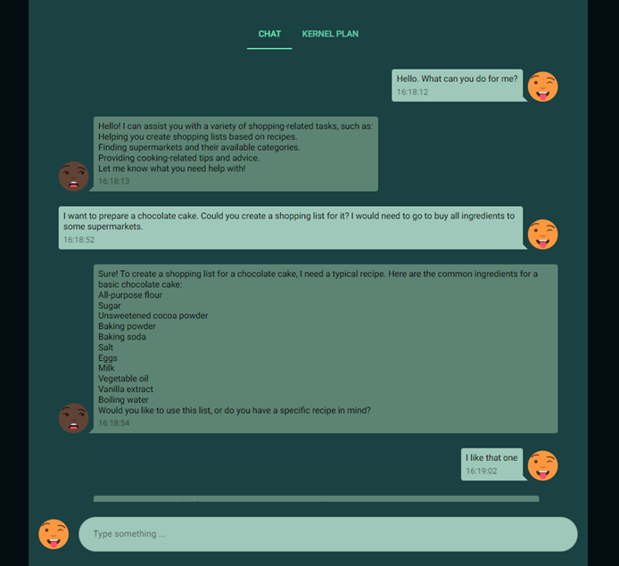
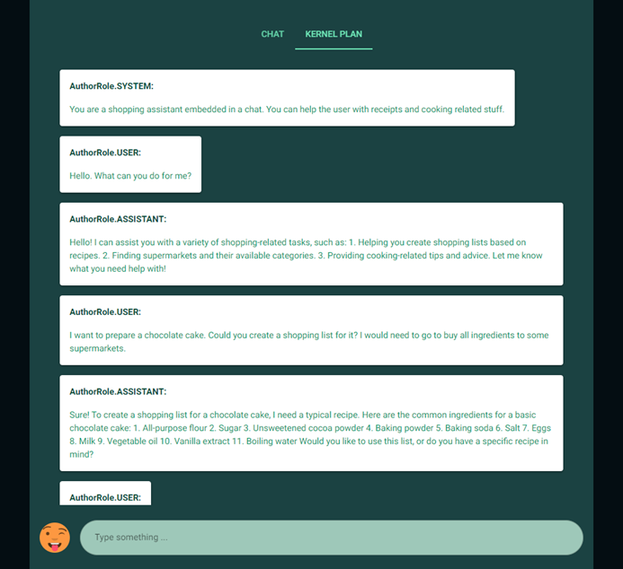

# Python Chatbot with Semantic Kernel Plugins

Welcome to the Python Chatbot for Semantic Kernel project! This repository contains a ready-to-use chatbot template integrated with sample Semantic Kernel plugins. The project includes a standar chat interface together with a Semantic Kernel planner viewer, where you can inspect in real time how the function calling has create the plan, and the tools used to respond the user.

## Features

- **Chat interface:** A simple user-friendly chat interface for interacting with the chatbot.



- **Semantic Kernel Plugins:** Pre-integrated with Semantic Kernel, with some sample plugins to showcase how to enhanhce the chatbot's capabilities.
- **Plan execution inspector:** Inspect in real time how Semantic Kernel interacts with your Plugins.



## Getting Started

### Prerequisites

- Python Version 3.10 or later
- Pip Version 22 or later

## Installation

1. Clone the repository:

```bash
git clone https://github.com/DavidGSola/sk-sample-chatbot.git
cd sk-sample-chatbot
```

2. Create new virtual environment:

```bash
py -m venv .venv
.venv\Scripts\activate
```

3. Install dependencies:

```bash
py -m pip install -r requirements.txt
```

## Usage

Python Chatbot for Semantic Kernel contains a set of basic plugins to showcase it. However, it is straightforward to customize it for your own use case.

### Configure Semantic Kernel: 

Rename `.env.sample` file to `.env` and add your connection details.

### Edit the system prompt:

Customize your chatbot by editing the [persona](https://learn.microsoft.com/en-us/semantic-kernel/frameworks/agent/personas?pivots=programming-language-python) in the `__main__.py` file.

```py
agent.define_agent(
"""
    Set here your own system prompt.
""")
```

### Create your own Plugins:

Define your own [Plugins](https://learn.microsoft.com/en-us/semantic-kernel/concepts/plugins/?pivots=programming-language-python) for your use case within the `plugins` folder.

Edit the `__init__` method within the `Agent` class to register your new Plugins.

```py
# Native plugin
self.kernel.add_plugin(PluginClass(), plugin_name="plugin_name")
# Prompt plugin
self.kernel.add_plugin(parent_directory="./plugins", plugin_name="plugin_name")
```

## License
This project is licensed under the MIT License. See the LICENSE file for details.